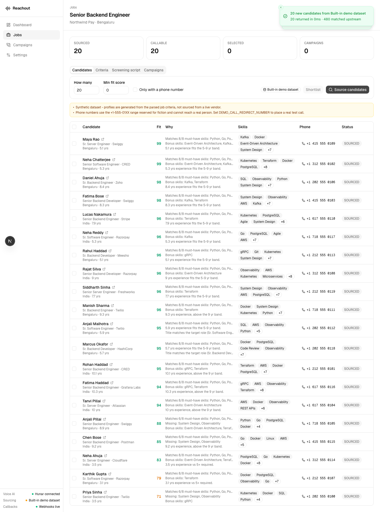
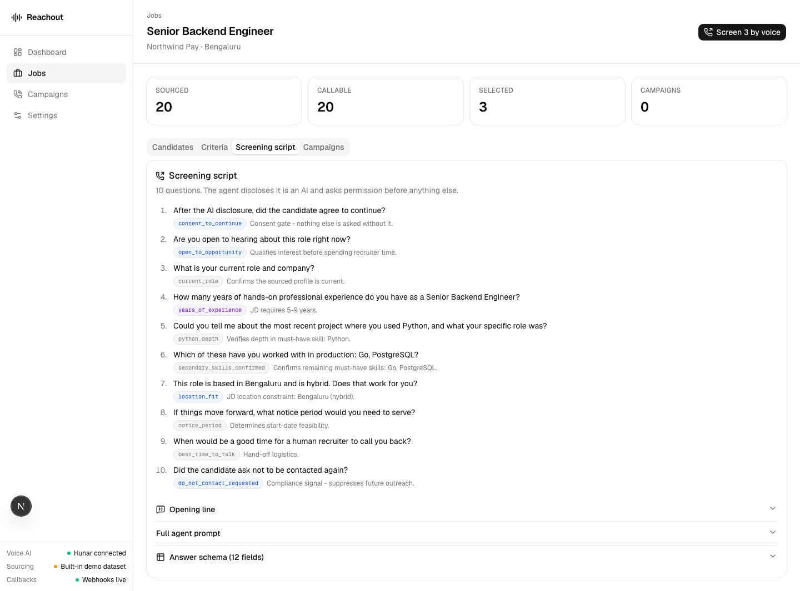
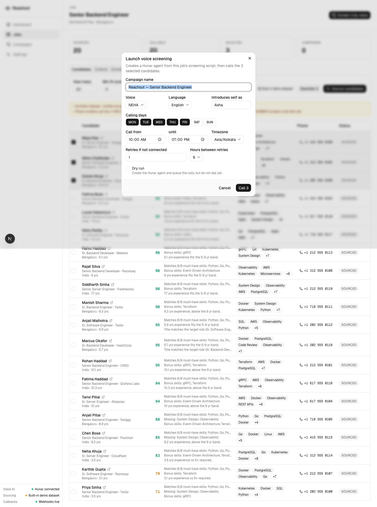
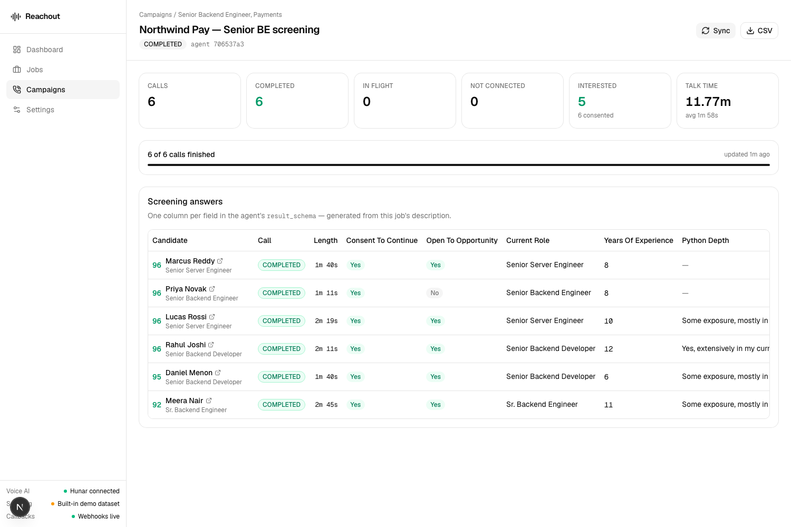
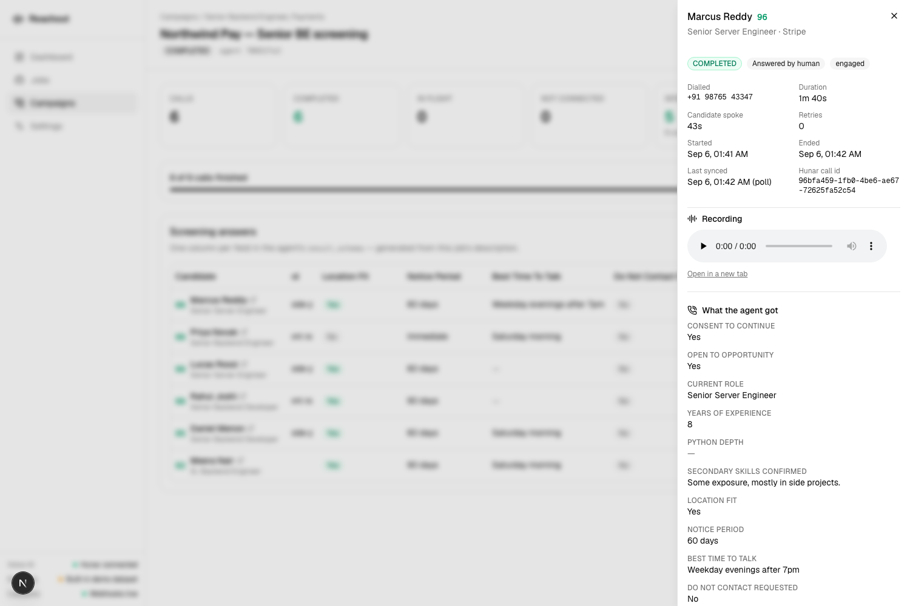
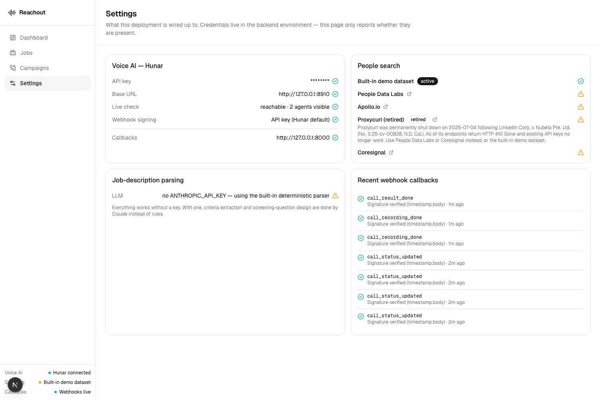

# HireFlow AI — people search + AI voice screening

Paste a job description. The app turns it into a people-search query, sources
matching candidates, has an **AI voice agent phone-screen them**, and puts the
structured answers into a dashboard.

```
 job description
       │
       ├─► parse ──────────►  search criteria      (titles, skills, years, location)
       │                      screening questions  (what to ask on the call)
       │                      result_schema        (what to bring back)
       │
       ├─► people search ──►  candidates, scored and ranked against the JD
       │                      (People Data Labs · Apollo.io · Coresignal · demo dataset)
       │
       ├─► voice agent ────►  Hunar agent built from the JD, one call per candidate
       │                      (consent-first, under three minutes)
       │
       └─► dashboard ──────►  one row per call, one column per screening answer
                              + recording, call metadata, CSV export
```

The interesting part is the middle: **the job description generates the voice
agent.** Its must-have skills become the questions the agent asks, and those
questions become the `result_schema` Hunar extracts against — which in turn
becomes the columns of the results table. Change the JD and every downstream
artefact changes with it. Nothing about the screening flow is hard-coded to a
particular role.

---

## Screenshots

| | |
|---|---|
|  |  |
| Candidates ranked by an explainable fit score | The screening script the JD produced |
|  |  |
| Voice, language, calling window, retries | Live call dashboard with the answers |
|  |  |
| One call: metadata, recording, every answer | What this deployment is actually wired to |

---

## Where to put the API key

The Hunar key is read **only from the environment** and never appears in the
source or in any committed file.

```bash
cp .env.example backend/.env      # backend/.env is git-ignored
```

Then edit `backend/.env` and set one line:

```bash
HUNAR_API_KEY=hunar_va_live_sk_…your key…
```

That is the only credential you need — everything else has a working default.
Restart the backend and the sidebar will show **Voice AI · Hunar connected**;
`GET /api/meta/config` reports only a masked fingerprint (`huna…XvxQ`), never
the key itself.

> The assignment key expires three days after issue. When it does, the app keeps
> working — sourcing, scoring and script generation are unaffected — and call
> creation returns a clear *“Hunar rejected the API key (401)”* rather than
> failing silently.

---

## Quick start

Requirements: Python 3.12+, Node 20+.

```bash
make install     # backend venv + npm install
make dev         # backend on :8000, frontend on :3000
```

Or by hand:

```bash
# backend
python3.12 -m venv backend/.venv
backend/.venv/bin/pip install -r backend/requirements-dev.txt
cp .env.example backend/.env          # add HUNAR_API_KEY
cd backend && ./.venv/bin/uvicorn app.main:app --reload --port 8000

# frontend (second terminal)
cd frontend && npm install
echo "NEXT_PUBLIC_API_BASE_URL=http://localhost:8000" > .env.local
npm run dev
```

Open <http://localhost:3000>. API docs are at <http://localhost:8000/docs>.

### Try it in 60 seconds

1. **Jobs → New job → Use a sample → Analyse.** The right-hand panel shows the
   criteria and the screening script *before* you save anything.
2. **Save job → Source candidates.** 20 scored candidates, each with the reasons
   behind its score.
3. Tick a few, **Screen N by voice**. Tick *Dry run* first if you just want to
   see the Hunar agent get created without dialling.
4. The campaign page polls every 5 seconds while calls are live and stops on its
   own when they finish.

---

## Placing a real call

The built-in demo dataset generates phone numbers in the **+1-(NPA)-555-01XX**
range reserved for fiction, and the backend **refuses to dial them** — you would
otherwise be cold-calling a synthetic person. Two ways to place a real call:

**A. Redirect every call to your own handset** (best for a demo)

```bash
# backend/.env
DEMO_CALL_REDIRECT_NUMBER=+919876543210
```

Every call in every campaign goes to that number instead of the candidate's. The
UI shows a persistent amber banner whenever this is on, and each affected call is
tagged `redirected`.

**B. Give a candidate a real number.** Click the phone cell in the candidate
table and paste one in E.164 form. That candidate becomes callable on its own.

### Webhooks vs polling

Hunar posts call status, recordings and results back to four callback URLs. Those
need a public HTTPS endpoint:

```bash
./scripts/tunnel.sh        # cloudflared quick tunnel, no account needed
```

It writes `PUBLIC_BASE_URL` into `backend/.env` for you; restart the backend and
callbacks flow in. Signatures are verified (HMAC-SHA256 over
`"{timestamp}." + raw_body`, keyed by the API key) and every callback is logged
with its verdict — visible under **Settings → Recent webhook callbacks**.

Without a public URL the app **polls** `GET /calls/{id}` every 15 seconds
instead, so the dashboard is correct either way. Both paths funnel into the same
reconciliation function, so a duplicated or out-of-order callback is harmless.

### Exercising the whole pipeline without dialling anyone

`backend/tools/hunar_stub.py` is a local stand-in for the Hunar API. It enforces
the same contract — `X-API-Key` auth, `custom_variables` derived from
`{placeholders}`, a 422 when `custom_data` is incomplete, string-only
`custom_data` values — then walks each call through RINGING → IN_PROGRESS →
COMPLETED on a timer and posts back **genuinely signed** webhooks with answers
synthesised against the agent's own `result_schema`.

```bash
cd backend
.venv/bin/python tools/hunar_stub.py --port 8910    # terminal 1

# backend/.env
HUNAR_API_KEY=stub-key
HUNAR_BASE_URL=http://127.0.0.1:8910
PUBLIC_BASE_URL=http://127.0.0.1:8000
```

Launch a campaign and the dashboard fills in over the next ~15 seconds, webhook
signatures and all. The screenshots above were taken this way. It is also how
you can see the product work when the assignment key has expired.

---

## Architecture

```
frontend/                Next.js 16 · TypeScript · Tailwind v4 · shadcn/ui
  src/app/               dashboard · jobs · job detail · campaigns · settings
  src/components/        results table, call detail sheet, campaign launcher
  src/lib/api.ts         typed client; surfaces the backend's own error text
  e2e/walkthrough.mjs    headless-browser walk of the whole product

backend/                 FastAPI · SQLAlchemy 2 · Pydantic v2 · SQLite/Postgres
  app/services/
    jd_parser.py         JD -> criteria      (Claude, with a deterministic fallback)
    screening.py         criteria -> voice agent prompt + result_schema
    scoring.py           explainable candidate <-> JD fit score
    hunar.py             typed Hunar client (agents, calls, numbers)
    campaigns.py         create agent -> dispatch calls -> reconcile results
    webhook_security.py  HMAC verification of Hunar callbacks
    people_search/       one interface, five providers
  app/api/routers/       jobs · candidates · campaigns · webhooks · meta
  app/workers/poller.py  background reconciliation loop
```

### Design decisions worth calling out

**The JD drives everything, including the agent.** `screening.py` builds the
agent prompt, introduction and `result_schema` from the parsed criteria. It also
asserts an invariant that would otherwise cause every call to fail: Hunar derives
`custom_variables` from `{placeholders}` in the prompt and rejects any call whose
`custom_data` does not carry all of them. The app checks that set against what it
will actually send *before* creating the campaign, and refuses with a readable
error rather than 422-ing on every call.

**Everything degrades instead of breaking.** No `ANTHROPIC_API_KEY`? A
deterministic parser over a curated skill taxonomy handles the JD, and the UI
says so. No people-search vendor key? The built-in dataset is generated *from the
parsed criteria*, so search → scoring → shortlist → screening still demonstrates
the real behaviour. No public URL? Polling. The `/settings` page reports honestly
what is live and what is falling back.

**Scores are explainable and deterministic.** Fit is five weighted dimensions
(must-have skills 40, experience 25, title 20, location 10, nice-to-have 5), each
producing a sentence — *"Matches 8/8 must-have skills…"*, *"4.4 yrs experience vs
5+ required"*. No model in the ranking path, so the order never changes between
page loads and a recruiter can argue with it.

**Consent-first calling.** The generated agent must disclose that it is an AI,
name the company, say the profile came from a data search, and get permission
before asking anything. A decline ends the call immediately with no pitch.
`do_not_contact_requested` is a first-class result field, and the dashboard
surfaces it. The question designer also drops anything discriminatory (age,
marital status, religion, caste, gender, health, national origin) if the LLM
proposes it.

---

## People search providers

One interface (`PeopleSearchProvider`), one normalised `SourcedProfile`, five
implementations. Switch with `PEOPLE_PROVIDER` and the matching key.

| Provider | Status | Phone numbers | Notes |
|---|---|---|---|
| **Built-in demo dataset** | Default, no key | Fictional (+1-555-01XX) | Generated from the parsed criteria; deterministic, so results are stable |
| **People Data Labs** | Ready, needs `PDL_API_KEY` | `mobile_phone` / `phone_numbers`, plan-dependent | Sends `dataset: "all"` — the default `resume` dataset fills mobiles on ~7% of records |
| **Apollo.io** | Ready, needs `APOLLO_API_KEY` | Masked on search | Direct dials need the enrichment endpoint; the UI says so instead of showing empty columns |
| **Coresignal** | Ready, needs `CORESIGNAL_API_KEY` | **None, any tier** | Its acceptable-use policy excludes personal phone numbers; employee records carry professional email only |
| **Proxycurl** | **Retired** | — | Shut down 2025-07-04 after *LinkedIn Corp. v. Nubela Pte. Ltd.* (No. 3:25-cv-00828, N.D. Cal.); every endpoint returns HTTP 410 |

Proxycurl is listed in the assignment brief, so rather than delete it the
provider is kept as an explicit tombstone: it fails fast with the reason, the
settings page marks it *retired*, and the registry falls back to a live provider.

The honest summary: **on free tiers, none of these vendors reliably hand you a
dialable mobile number.** That is a real constraint on this problem, not a gap in
the integration — which is why the app makes numbers editable per candidate and
ships a redirect switch for demos.

---

## Configuration

Every setting, with a working default. See `.env.example`.

| Variable | Default | Purpose |
|---|---|---|
| `HUNAR_API_KEY` | — | **The only key you need.** Voice calls. |
| `PEOPLE_PROVIDER` | `mock` | `mock` · `pdl` · `apollo` · `coresignal` |
| `PDL_API_KEY` / `APOLLO_API_KEY` / `CORESIGNAL_API_KEY` | — | Per-vendor keys |
| `ANTHROPIC_API_KEY` | — | Optional. LLM JD parsing + question design |
| `DATABASE_URL` | `sqlite:///./data/hireflow.db` | Any Postgres DSN also works |
| `PUBLIC_BASE_URL` | — | HTTPS base for Hunar webhooks; empty ⇒ polling |
| `DEMO_CALL_REDIRECT_NUMBER` | — | Route every call to one test handset |
| `CORS_ORIGINS` | `http://localhost:3000` | Comma-separated, or `*` |
| `ENABLE_CALL_POLLER` | `true` | Background reconciliation loop |
| `CALL_POLL_INTERVAL_SECONDS` | `15` | Poll cadence |

---

## Testing

```bash
make test                                  # backend suite (pytest + respx, no network)
cd frontend && node e2e/walkthrough.mjs    # headless walk of the real UI
```

The browser walkthrough drives the product the way a recruiter would — paste a
JD, analyse, save, source, select, launch — screenshots each step into
`docs/screenshots/`, and fails the run on any console error or failed request.
It caught two real bugs during development: a null-dereference on the job page
before data loaded, and timestamps rendering 5½ hours off because SQLite drops
timezone information.

---

## Deployment

`docs/DEPLOYMENT.md` has the full comparison and copy-pasteable steps. The short
version:

| Option | Free? | Card? | Persistence | Effort |
|---|---|---|---|---|
| Render (backend) + Vercel (frontend) | Yes | No | Needs external Postgres | Low |
| All-Vercel + Neon Postgres | Yes | No | Neon | Low |
| `docker compose` locally | Anywhere | — | Named volume | Low |

Ready to go: `backend/Dockerfile`, `render.yaml`, `vercel.json` for both halves,
`docker-compose.yml`, and
`scripts/deploy-render.sh` / `scripts/deploy-vercel.sh` which run
non-interactively from `RENDER_API_KEY` / `VERCEL_TOKEN`.

**SQLite does not persist on Render free or on Vercel** (no disk / ephemeral
filesystem). Point `DATABASE_URL` at Neon for anything you intend to keep.

---

## Security notes

- Secrets come from the environment only. `.env` is git-ignored; `.env.example`
  ships with every key blank.
- The logger redacts anything matching a credential pattern, and any field named
  `api_key`, `authorization`, `token`, `secret`, … — verified by test.
- `/api/meta/config` reports *whether* a credential is set plus a masked
  fingerprint. It never returns a key.
- Webhook callbacks are signature-verified; failures are recorded with the
  reason and not applied.
- Recording URLs are unguessable but publicly readable — treat them as secrets.

---

## Also in this repo

`docs/QUESTION-3.md` — the written answer to the assignment's third question
(tracking attendance for 1,000 people across 100 sites with no smartphones and no
apps). It lands on the same architecture this app implements: an LLM turns a spec
into a voice-agent script and a result schema, the agent makes the calls, and the
structured answers land in a dashboard.

---

## API

Interactive docs: `http://localhost:8000/docs`.

| Method | Path | |
|---|---|---|
| `POST` | `/api/jobs/parse` | Parse a JD without saving it |
| `POST` | `/api/jobs` | Create a job (parses + designs the script) |
| `GET` | `/api/jobs/{id}/screening-plan` | The agent script this job produces |
| `POST` | `/api/jobs/{id}/search` | Run a people search |
| `POST` | `/api/jobs/{id}/shortlist` | Mark candidates shortlisted |
| `PATCH` | `/api/candidates/{id}/phone` | Add a dialable number |
| `POST` | `/api/jobs/{id}/campaigns` | Create the agent and place calls |
| `GET` | `/api/campaigns/{id}` | Calls, stats and answer columns |
| `POST` | `/api/campaigns/{id}/sync` | Force a reconcile with Hunar |
| `GET` | `/api/campaigns/{id}/export.csv` | Flat export, one column per answer |
| `POST` | `/api/webhooks/hunar/{status,recording,result,summary}` | Hunar callbacks |
